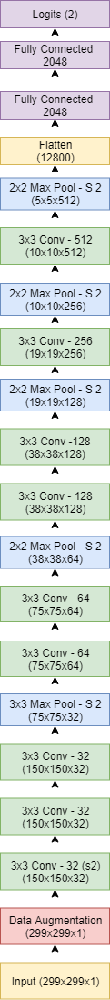

# ConvNets for Detection of Abnormalities in Mammograms
Eric Scuccimarra (skooch@gmail.com)

## Introduction
Breast cancer is the second most common cancer in women worldwide. About 1 in 8 U.S. women (about 12.4%) will develop invasive breast cancer over the course of her lifetime. The five year survival rates for stage 0 or stage 1 breast cancers are close to 100%, but the rates go down dramatically for later stages: 93% for stage II, 72% for stage III and 22% for stage IV. Human recall for identifying lesions is estimated to be between 0.75 and 0.92 [1], which means that as many as 25% of abnormalities may go undetected. 

The DDSM is a well-known dataset of normal and abnormal scans, and one of the few publicly available datasets of mammography imaging. Unfortunately, the size of the dataset is relatively small. To increase the amount of training data we extract the Regions of Interest (ROI) from each image, perform data augmentation and then train ConvNets on the augmented data. The ConvNets were trained to predict both whether a scan was normal or abnormal, and to predict whether abnormalities were calcifications or masses and benign or malignant.

## Related Work
There exists a great deal of research into applying deep learning to medical diagnosis, but the lack of available training data is a limiting factor, and thus there is not much research into applying ConvNets to mammography. [1, 4] use ConvNets to classify pre-detected breast masses by pathology and type, but do not attempt to detect masses from scans. [2,3] detect abnormalities using combinations of region-based CNNs and random forests. 

## Datasets
The MIAS dataset is a very small set of mammography images, consisting of 330 scans of all classes. The scans are standardized to a size of 1024x1024 pixels. The size of the dataset made this unusable for training, but it was used for exploratory data analysis and as a supplementary test data set.

The University of California Irvine Machine Learning Repository [5] contains several datasets related to breast cancer.  These consist of one dataset which describes the characteristics of abnormalities and two which describe the characteristics of cell nuclei taken from fine needle biopsies. These were used for exploratory data analysis to gain insight into the characteristics of abnormalities.

The DDSM [6] is a database of 2,620 scanned film mammography studies. It contains normal, benign, and malignant cases with verified pathology information. The DDSM is saved as Lossless JPEGs, an archaic format which has not been maintained for several decades. 

The CBIS-DDSM [8] collection includes a subset of the DDSM data selected and curated by a trained mammographer. The CBIS-DDSM images have been pre-processed and saved as DiCom images, and thus are better quality than the DDSM images, but this dataset only contains scans with abnormalities. In order to create a dataset which can be used to predict the presence of abnormalities, the ROIs were extracted from the CBIS-DDSM dataset and combined with normal images taken from the DDSM dataset.

## Methods

### Data Preprocessing
In order to create a training dataset of adequate size which included both normal and abnormal scans, images from the CBIS-DDSM dataset were combined with images from the DDSM dataset. While the CBIS-DDSM dataset included cropped and zoomed images of the Regions of Interest (ROIs), in order to have greater control over the data we extracted the ROIs ourselves using the masks provided with the dataset. 

For the CBIS-DDSM images the masks were used to isolate and extract the ROI from each image. For the DDSM images we simply created tiles of each scan and included them as long as they met certain criteria.

Both offline and online data augmentation was used to increase the size of the datasets. 

#### Training Datasets
Multiple datasets were created using different ROI extraction techniques and amounts of data augmentation. The datasets ranged in size from 27,000 training images to 62,000 training images. 

Datasets 1 through 5 did not properly separate the training and test data and thus are not referenced in this work.

1. Dataset 6 consisted of 62,764 images. This dataset was created to be as large as possible, and each ROI is extracted multiple times in multiple ways using both ROI extraction methods described below. Each ROI was extracted with fixed context, with padding, at its original size, and if the ROI was larger than our target image it was also extracted as overlapping tiles. 
2. Dataset 8 consisted of 40,559 images. This dataset used the extraction method 1 described below to provide greater context for each ROI. This dataset was created for the purpose of classifying the ROIs by their type and pathology.
3. Dataset 9 consisted of 43,739 images. The previous datasets had used zoomed images of the ROIs, which was problematic as it required the ROI to be pre-identified and isolated. This dataset was created using extraction method 2 described below.

As Dataset 9 was the only dataset that did not resize the images based on the size of the ROI we felt that it would best train a network which could be used to predict unaugmented scans, and thus we focused on it for our results.

### ROI Extraction Methods for CBIS-DDSM Images
The CBIS-DDSM scans were of relatively large size, with a mean height of 5295 pixels and a mean width of 3131 pixels. Masks highlighting the ROIs were provided. The masks were used to define a square which completely enclosed the ROI. Some padding was added to the bounding box to provide context and then the ROIs were extracted at 598x598 and then resized down to 299x299 so they could be input into the ConvNet. 

The ROIs had a mean size of 450 pixels and a standard deviation of 396. As Inception v4 accepts 299x299 images as input, 598x598 was used as our target size because it was double the image size and also was just large enough that the majority of the ROIs could fit into it.

To increase the size of the training data, each ROI was extracted multiple times using the methodologies described below. The size and variety of the data was also increased by randomly horizontally flipping each tile, randomly vertically flipping each tile, randomly rotating each tile, and by randomly positioning each ROI within the tile.

#### ROI Extraction Method 1
The analysis of the UCI data indicated that the edges of an abnormality were important as to determining its pathology and type, and this was confirmed by a radiologist. Levy et al [1] also report that the inclusion of context was an important contributor to the accuracy of the classification.

To provide maximum context, each ROI was extracted in multiple ways:

1.	The ROI was extracted at 598x598 at its original size.
	.	The entire ROI was resized to 598x598, with padding to provide context.
	.	f the ROI had the size of one dimension more than 1.5 times the other dimension it was extracted as two tiles centered in the center of each half of the ROI along it's largest dimension.

#### ROI Extraction Method 2
The previous datasets relied on having the ROIs pre-identified and the ROI was then zoomed to fit our target size and cropped. While this provided very good, clear images of each ROI, the fact that each image was resized based on the size of the ROI made the dataset too artificial to be used to train a model which could take raw scans as input. This method was designed to counter that by not resizing the ROIs at all.

For this method each ROI was extracted, at it's actual size, with padding depending on it's size, and then the resulting image was randomly cropped:

1. If the ROI was smaller than a 598x598 tile it was extracted with 20% padding on either side. 
2. If the ROI was larger than a 598x598 tile it was extracted with 5% padding.
3. Each ROI was then randomly cropped three times using random flipping and rotation. 

#### Normal Images
The normal scans from the DDSM dataset did not have ROIs so were processed differently. As these images had not been pre-processed they contained artifacts such as white borders, overlay text, and white patches of pixels used to cover up identifying personal information. Each image was trimmed by 7% on each side to remove the white borders.

To keep the normal images as similar to the CBIS-DDSM images, different pre-processing was done for each dataset created. As datasets 6 and 8 resized the images based on the ROI size, to create the DDSM images for these datasets, each image was randomly sized down by a random factor between 1.8 and 3.2, then segmented into 299x299 tiles with a variable stride between 150 and 200. Each tile was then randomly rotated and flipped.

For dataset 9, each DDSM image was cut into 598x598 tiles with the size unchanged, and then the tiles were sized down to 299x299.

To avoid the inclusion of images which contained the aforementioned artifacts or which consisted largely of black background, each tile was then added to the dataset only if it met upper and lower thresholds on mean and variance. These thresholds were determined by random sampling of tiles and set to exclude tiles which contained large chunks of white pixels or were mostly black.

#### MIAS Images
As the MIAS images come from a completely different distribution than the DDSM images, we felt they could provide a good assessment of how well the models would generalize. For this reason we created a supplementary test dataset consisting of the 330 MIAS images.

The MIAS images were a uniform size of 1024x1024, with each scan sized to a height of 1024 and then horizontally padded with black on both sides. To get these images to the same scale as the DDSM images we increased their size by 2.58, which brought them to half the mean height of the DDSM images. The ROIs were then extract using the same methods used for the CBIS-DDSM images except the ROIs were extracted directly at 299x299 rather than being extracted at 598x598 and then sized down by half.

### Data Balance
In reality, only about 10% of mammograms are abnormal. In order to maximize recall, we weighted our dataset more heavily towards abnormal scans, with the balance at 83% normal and 17% abnormal. 

The CBIS-DDSM dataset was already divided into training and test data, at 80% training and 20% test. As each ROI was extracted to multiple images, in order to prevent different images of the same ROIs from appearing in both the training and holdout datasets we kept this division. The test dataset was divided evenly, in order, between holdout and test data, which ensures that no more than one image of one ROI would appear in both datasets. 

The normal images had no overlap, so were shuffled and divided among the training, test and validation data. The final divisions were 80% training, 10% test and 10% validation. It would have been preferable to have large validation and test datasets, but we felt that it was easier to use the existing divisions and be sure that there was no overlap.

### Labels
In the CBIS-DDSM dataset the scans are grouped into the following categories:
1.	Normal
	.	Benign Calcification
	.	Malignant Calcification
	.	Benign Mass
	.	Malignant Mass

Although we did experiment with classifying images directly into all five categories, as previous work [1] has already dealt with classifying pre-identified abnormalities, we focused on classifying images as normal or abnormal.

### ConvNet Architecture
Our first thought was to train existing ConvNets, such as VGG or Inception, on our datasets. These networks were designed for and trained on ImageNet data, which contains images which are completely different from medical imaging. The ImageNet dataset contains 1,000 classes of images which have a far greater amount of detail than our scans do, and we felt that the large number of parameters in these models might cause them to quickly overfit our data and not generalize well. A lack of computational resources also made training these networks on our data impractical. For these reasons we designed our own architectures specifically for this problem.

We started with a simple model based on VGG, consisting of stacked 3x3 convolutional layers alternating with max pools followed by three fully connected layers. Our model had fewer convolutional layers with less filters than VGG, and smaller fully connected layers. We also added batch normalization [15] after every layer. This architecture was then evaluated and adjusted iteratively, with each iteration making one and only one change and then being evaluated. We also evaluated techniques including Inception-style branches [16, 17, 18] and residual connections [19]. 

To compensate for the unbalanced nature of the dataset a weighted cross-entropy function was used, weighting positive examples higher than negative ones. The weight was considered a hyperparameter for which values ranging from 1 to 7 were evaluated.

The best performing architecture will be detailed below.

### Training
At first, initial evaluation of models was done using Dataset 5 due to its relatively small size. Each model was trained through between 30 and 50 epochs and recall, accuracy, precision, and f1 score were used to evaluate performance. 

Due to the fact that Dataset 5 was created without proper separation of the training and test datasets, it is likely that variations of the same images were including in both the training and validation datasets, making the validation dataset essentially useless. Once we realized this we stopped using Dataset 5 and started evaluating with Datasets 8 and 9.

As Dataset 9 best represented our goals for this work, for the final phases we trained and evaluated models exclusively on this dataset.

#### Online Data Augmentation

We had built in optional online data augmentation to our graphs, but enabling it slowed down training significantly as it ran on the CPU rather than the GPU and thus became a bottleneck. We found code online [22] which enabled the GPU to handle the data augmentation and eliminated the bottleneck. Enabling this applied random horizontal and vertical flips to the images, which improved performance and allowed the models to be trained for longer by reducing overfitting. 

#### Transfer Learning
We had considered using transfer learning from VGG or Inception, but, as described above, felt that the features of the ImageNet data were different enough from those of radiological scans that they would not generalize well to our datasets. This hypothesis was evaluated by using pre-trained versions of VGG-19 and Inception v3 to extract the features from our images and then re-train the final layers to predict to our classes. Our hypothesis was confirmed as this method never achieved accuracy significantly better than random guessing.

We also evaluated transfer learning with our own models by initializing the weights of convolutional layers with the weights from previously trained networks. We thought that training a network to classify to all five classes might encourage the network to learn distinguishing features of abnormalities, and we would then initialize the weights of the fully-connected layers and re-train the network for binary classification. This approach did not yield results any better than training networks from scratch for binary classification, so was abandoned.

## Results
### Architecture
We evaluated a large number of models on our datasets, including customized versions of VGG-16 and Inception v4. The 1.0.0.x family of custom models performed the best.

* Model 1.0.0.29 had nine convolutional layers and three fully connected layers. The convolutional layers used the philosophy of VGG, with 3x3 convolutions stacked and alternated with max pools.
* Model 1.0.0.35 was identical to 1.0.0.29 but with the input data scaled to be between 0 and 1.
* Model 1.0.0.46 had the input scaled and centered to the mean.

Models 1.0.0.35 and 1.0.0.45 also included optional online contrast adjustment and online data augmentation.

​                                                                *Figure 1: Architecture of model 1.0.0.35*

A variety of other architectures were evaluated which included things like residual connections and Inception-style branches. However these models in general did not perform as well as the simpler models and took a significantly longer time to train. 

A slightly modified version of VGG-16 was also trained as a benchmark. A full version of VGG-16 required more memory than we had available, so we made the following alterations to the architecture:

1. The architecture was altered to accept 299x299 images as input
2. The stride of the first convolutional layer was changed to 2
3. Batch normalization was included after every layer
4. The first fully connected layer had 1024 units instead of 4096, and the second fully connected layer had 512 units.

These changes brought the memory requirements down to acceptable levels and doubled the training speed. While changing the stride of convolutional layer 1 decreased the training accuracy, we felt that it might allow the model to generalize a bit better.

Finally we attempted to train a customized version of Inception v4 on our datasets. Our version had the number of filters in each convolutional layer cut in half and we replaced the global average pooling with a flatten followed by two fully-connected layers. The time required to train this model made it impractical to work on further, and the results we obtained did not merit any further exploration.

### Performance
Different models performed differently on different datasets with different classification methods. Unsurprisingly, all models on all datasets performed better at binary classification than on multi-class classification. The complete results for all of our models evaluated are in the Excel spreadsheet "model notes.xlsx." 

Table 1 shows the accuracy and recall on the test dataset for selected models trained for binary classification. The most-frequent baseline accuracy for the datasets was .83. We should note that a recall of 1.0 with accuracy around .17 indicates that the model is predicting everything as positive, while an accuracy near .83 with a very low recall indicates the model is predicting everything as negative.

|Model          |Classification |Dataset    |Epochs |Accuracy    |Recall      |
|---------------|---------------|-----------|-------|------------|------------|
|1.0.0.35b.98   |         Binary|          9|40     |.9571       |.9012       |
|1.0.0.46b      |         Binary|          9|30     |.8370       |.0392       |
|1.0.0.29n      |         Binary|          8|30     |.9930       |1.0         |
|1.0.0.46b      |         Binary|          6|20     |.1810       |1.0         |
|VGG-16.03.06b.9|         Binary|          9|30     |.8138       |.9884       |
|inception_v4.05b.9|      Binary|          9|20     |.1828       |1.0         |
​                 
<i>Table 1: Binary Performance on Test Set</i>
 

Table 2 shows the accuracy and recall of the test dataset for selected training runs for multi-class classification. We see the trend of models tending to predict everything as either negative or positive.

|Model          |Classification |Dataset    |Epochs |Accuracy    |Recall      |Initialization |
|---------------|---------------|-----------|-------|------------|------------|---------------|
|1.0.0.29n      |    Multi-class|          6|40     |.9142       |.9353       |Scratch        |
|1.0.0.46l.8    |    Multi-class|          8|20     |.1139       |1.0         |Scratch        |
|1.0.0.46l.6    |    Multi-class|          6|20     |.8187       |0           |Scratch        |
|VGG-16.03.04l.6|    Multi-class|          6|20     |.8333       |.0288       |Scratch        |
​                
<i>Table 2: Multi-class Performance on Test Set</i>
 

Figure 2 shows the training metrics for model 1.0.0.29 trained on dataset 8 for binary classification. This model was trained with a cross entropy weight of 2 which may have contributed to the volatility of the validation results.

 
           <i>Figure 2 - Binary Accuracy and Recall for Model 1.0.0.29 on Dataset 8</i>

Figure 3 shows the training metrics for model 1.0.0.45 trained on dataset 9 for binary classification. We see that this model was learning to predict positive examples through epoch 15, at which point the accuracy drops to the baseline and the recall approaches 0. We believe this is due to the cross entropy weight of 2 used for this model, which encourages the model to ignore positive examples and focus on negative ones.

 
           <i>Figure 3 - Binary Accuracy and Recall for Model 1.0.0.45 on Dataset 9</i>

Figure 4 shows the training metrics for model 1.0.0.35 trained on dataset 9 for binary classification. This model was trained with a cross entropy weight of 6, which compensates for the unbalanced nature of the dataset and encourages the model to focus on positive examples.

 
       <i>Figure 4 - Binary Accuracy and Recall for Model 1.0.0.35 b.98 on Dataset 9</i> 

While model 1.0.0.29 achieved the best results, we were unable to duplicate these results in future training runs and thus conclude that the high recall and accuracy were flukes that were not due to inherent advantages of the model.

Table 3 shows the accuracy and recall of selected models on the MIAS dataset. If we recall that the MIAS dataset was completely separate from, and unrelated to, the DDSM datasets, these results should indicate how well the model will perform on completely unrelated images. 

These results indicate that model 1.0.0.35b.98 was able to achieve relatively high accuracy and recall, while the others traded off precision and recall. For this reason we feel that this model is the most promising one to pursue.

|Model          |Training Dataset   |MIAS Accuracy    |MIAS Recall      |
|---------------|-------------------|-----------------|-----------------|
|1.0.0.35b.98   |9                  |.8883            |.8081            |
|vgg_16.3.06b.9 |9                  |.4357            |.9884            |
|1.0.0.28.2b.9  |9                  |.9165            |.5342            |
|1.0.0.46b.8.4  |8                  |.2746            |.9811            |

​                
<i>Table 3: Performance on MIAS Dataset</i>
 

### Effect of Cross Entropy Weight
As mentioned above, a weighted cross entropy was used to improve recall and counter the unbalanced nature of our dataset. Increasing the weight improved recall at the expense of precision. With a cross entropy weight of 1 to 3, our models tended to initially learn to classify positive examples, but after 15-20 epochs started to predict everything as negative. A cross entropy weight of 4 to 6 allowed the model to continue to predict positive examples and greatly reduced the volatility of the validation results.

| Model        | X-Entropy Weight | Test Accuracy | Test Recall |
| ------------ | ---------------- | ------------- | ----------- |
| 1.0.0.35b.98 | 6                | .9571         | .9012       |
| 1.0.0.35b.94 | 4                | .9364         | .7007       |
| 1.0.0.35b.9  | 2                | .8279         | 0.0         |

​               
<i>Table 4: Effect of Cross Entropy Weight</i>
 

### Effect of Input Data Scaling

We had attempted to scale and center our input data when creating the dataset but the size of the data made it impossible to compute the mean of the pixels, much less adjust them in memory. As a result, our first models, including 1.0.0.29, took the raw pixel data as input. For model 1.0.0.45 we had precalculated the mean and centered the data by subtracting it. This improved the training results, but had a detrimental effect on the validation results. 

This was surprising so we evaluated several combinations of centering and scaling the data and found that the best performance was achieved by scaling the input data to be between 0 and 1 without centering it. During this process we discovered that there was a problem with how our graph was constructed which led to the validation data bypassing the scaling step and being inserted directly into the first convolutional layer at a different scale than the training data. Once this was corrected we found that centering the data led to the behavior seen in Figure 3, where after 15 epochs the model would learn to predict everything negative. 

At the time we were using relatively low weights for the cross entropy, and we suspect that centering the data caused the model to learn faster. Without the proper cross entropy weighting this led to the model quickly starting to overfit the training data and predicting all validation examples as negative.

### Effect of Contrast Enhancement
While performing some exploratory manipulations of the images, we found that increasing the contrast of the scans could bring out subtle features and we added an optional contrast enhancement in the data augmentation part of the model. We attempted to train models using values for the contrast enhancement of between 1.0 and 2.0. 

In the end we found that training with a contrast of 1.0 (no contrast adjustment) yielded the best results. However increasing the contrast at test time allowed us to increase recall at the expense of precision.

### Effect of Decision Threshold

A binary softmax classifier has a default threshold of 0.50. We used pr curves during training to evaluate the effects of adjusting the threshold. We found that we could easily trade off precision and recall by adjusting the threshold, allowing us to achieve precision or recall close to 1.0.

Figure 5 is the curve for model 1.0.0.35b.98 after 40 epochs of training. The points on the lines indicate the threshold of 0.50. Precision is on the y-axis and recall on the x-axis.

​                                                     <i>Figure 5 - PR Curve for model 1.0.0.35b.98</i> 

## Conclusion
While we were able to achieve extraordinary results on datasets 6 and 8, the artificial nature of these datasets caused the models to not generalize to the MIAS data. Models trained on dataset 9, which was constructed specifically to avoid these problems, did not achieve accuracy or recall as high as models trained on other datasets, but generalized to the MIAS data fairly well.

The weight of the cross entropy turned out to be a critical factor in training models which did not overfit the training data, and whose performance could be replicated. We wasted a lot of time training models with low cross entropy weighting and trying to figure out why those models seemed so unstable.

While we were able to achieve recall significantly above human performance on the DDSM data, the recall on the MIAS data was significantly lower. However, as a proof of concept, we feel that we have demonstrated that ConvNets can successfully be trained to predict whether mammograms are normal or abnormal.

The life and death nature of diagnosing cancer creates many obstacles to putting a system like this into practice. We feel that using a system to output the probabilities rather than the predictions would allow such a system to provide additional information to radiologists rather than replacing them. In addition the ability to adjust the decision threshold would allow radiologists to focus on more ambiguous scans while devoting less time to scans which have very low probabilities.

Future work would include creating a system which would take an entire, unaltered scan as input and analyse it for abnormalities. Algorithms such as a sliding window, YOLO, or attention models could be used to apply our techniques to entire scans, and would also have the added benefit of indicating what regions of the scan require extra attention. Unfortunately, the lack of available training data seems to be the bottleneck for pursuing this in the future.

## Supplementary Files

### GitHub Repositories
Two personal GitHub repositories were used for this work:

1. https://github.com/escuccim/mias-mammography - contained the Jupyter notebooks and code run locally.
2. https://github.com/escuccim/mammography-models - was used to sync code between my laptop and the Google Cloud instances where the models were trained 

Any documents which are not in this repository should be located in one of those.

### Notebooks
- Wisconsin (UCI) EDA.ipynb - exploratory data analysis of the UCI data
- SVM.ipynb, kNN.ipynb, Decision Trees.ipynb, Multilayer neural networks.ipynb - application of standard machine learning techniques to the UCI data
- UCI Results.ipynb - results of above evaluations
- MIAS Exploratory Data Analysis.ipynb - exploratory data analysis of the MIAS data
- crop_cbis_images_x.ipynb - various methods used to extract ROIs from the CBIS-DDSM dataset for dataset x
- crop_normal_images_x.ipynb - corresponding code to create images from normal DDSM images for dataset x
- crop_mias_images_x.ipynb - corresponding code the create images from the MIAS dataset for dataset x
- review_images_x.ipynb - to review the images created in the above scripts and identify any problems for dataset x
- write_to_tfrecords_x.ipynb - create tfrecords files for dataset x
- convnet_1.0.0.35.ipynb - code used to train model 1.0.0.35 in a notebook, with results and evaluation on test data
- convnet_training_metrics.ipynb - training and validation metrics for selected training runs
- ddsm_results.ipynb - accuracy and recall metrics for selected training runs

### Python Scripts
- mammo_utils.py - functions used in pre-processing data
- training_utils.py - functions used for creating and training models
- inception_utils.py - functions used to create and train our Inception clone
- candidate_x.x.x.x - various candidate models trained
- vgg_16.x.py - code used to create and train our VGG-lite model
- inception_v4.x.py - code used to create and train our Inception-lite model

### Markdown Files
- ReadMe.md - what you are reading right now
- overview_of_image_processing.md - an overview of the steps taken to create and pre-process the image data

### Others
- data/results - metrics generated during training saved as .npy files
- the tfrecords used to train the models are available from download from Amazon S3. The URLs are in training_utils.py.
- Decompressing-For-LJPEG-image - code used to convert the DDSM images from LJPEG to usable images
- model_notes.xlsx - notes kept during training of models, only includes results relevant to this overview

### Training Logs
The TensorBoard training logs are also provided for selected models in the /logs/ directory. The logs include scalar metrics taken every 50 steps, image summaries of the kernels taken every epoch, and pr curves used to evaluate the effect of the decision threshold.

### Models
The following pre-trained models are available for download. Each zip file contains the checkpoint for the model:

- model_s1.0.0.29l.8.2 - trained on dataset 8 for binary classification - https://s3.eu-central-1.amazonaws.com/aws.skoo.ch/files/model_s1.0.0.29l.8.2.zip
- model_s1.0.0.35b.96 - trained on dataset 9 for binary classification - https://s3.eu-central-1.amazonaws.com/aws.skoo.ch/files/model_s1.0.0.35b.96.bu30.zip
- model_s1.0.0.35b.98 - trained on dataset 9 for binary classification - https://s3.eu-central-1.amazonaws.com/aws.skoo.ch/files/model_s1.0.0.35b.98.zip

## References
[1]	D. Levy, A. Jain, Breast Mass Classification from Mammograms using Deep Convolutional Neural Networks, arXiv:1612.00542v1, 2016

[2]	N. Dhungel, G. Carneiro, and A. P. Bradley. Automated mass detection in mammograms using cascaded deep learning and random forests. In Digital Image Computing: Techniques and Applications (DICTA), 2015 International Conference on, pages 1–8. IEEE, 2015.

[3]	N.Dhungel, G.Carneiro, and A.P.Bradley. Deep learning and structured prediction for the segmentation of mass in mammograms. In International Conference on Medical Image Computing and Computer-Assisted Intervention, pages 605–612. Springer International Publishing, 2015.

[4]	J.Arevalo, F.A.González, R.Ramos-Pollán,J.L.Oliveira,andM.A.G.Lopez. Representation learning for mammography mass lesion classification with convolutional neural networks. Computer methods and programs in biomedicine, 127:248–257, 2016.

[5]	Dua, D. and Karra Taniskidou, E. (2017). UCI Machine Learning Repository [http://archive.ics.uci.edu/ml]. Irvine, CA: University of California, School of Information and Computer Science.

[6]	The Digital Database for Screening Mammography, Michael Heath, Kevin Bowyer, Daniel Kopans, Richard Moore and W. Philip Kegelmeyer, in Proceedings of the Fifth International Workshop on Digital Mammography, M.J. Yaffe, ed., 212-218, Medical Physics Publishing, 2001. ISBN 1-930524-00-5.

[7]	Current status of the Digital Database for Screening Mammography, Michael Heath, Kevin Bowyer, Daniel Kopans, W. Philip Kegelmeyer, Richard Moore, Kyong Chang, and S. Munish Kumaran, in Digital Mammography, 457-460, Kluwer Academic Publishers, 1998; Proceedings of the Fourth International Workshop on Digital Mammography.

[8]	Rebecca Sawyer Lee, Francisco Gimenez, Assaf Hoogi , Daniel Rubin  (2016). Curated Breast Imaging Subset of DDSM. The Cancer Imaging Archive.

[9]	Clark K, Vendt B, Smith K, Freymann J, Kirby J, Koppel P, Moore S, Phillips S, Maffitt D, Pringle M, Tarbox L, Prior F. The Cancer Imaging Archive (TCIA): Maintaining and Operating a Public Information Repository, Journal of Digital Imaging, Volume 26, Number 6, December, 2013, pp 1045-1057.

[10]	O. L. Mangasarian and W. H. Wolberg: "Cancer diagnosis via linear programming", SIAM News, Volume 23, Number 5, September 1990, pp 1 & 18.

[11]	William H. Wolberg and O.L. Mangasarian: "Multisurface method of pattern separation for medical diagnosis applied to breast cytology", Proceedings of the National Academy of Sciences, U.S.A., Volume 87, December 1990, pp 9193-9196.

[12]	O. L. Mangasarian, R. Setiono, and W.H. Wolberg: "Pattern recognition via linear programming: Theory and application to medical diagnosis", in: "Large-scale numerical optimization", Thomas F. Coleman and YuyingLi, editors, SIAM Publications, Philadelphia 1990, pp 22-30.

[13]	K. P. Bennett & O. L. Mangasarian: "Robust linear programming discrimination of two linearly inseparable sets", Optimization Methods and Software 1, 1992, 23-34 (Gordon & Breach Science Publishers).

[14]	K. Simonyan, A. Zisserman, Very Deep Convolutional Networks for Large-Scale Image Recognition, arXiv:1409.1556, 2014

[15]	S. Ioffe and C. Szegedy. Batch normalization: Accelerating deep network training by reducing internal covariate shift. In Proceedings of The 32nd International Conference on Machine Learning, pages 448–456, 2015

[16]	C. Szegedy, W. Liu, Y. Jia, P. Sermanet, S. Reed, D. Anguelov, D. Erhan, V. Vanhoucke, and A. Rabinovich. Going deeper with convolutions. In Proceedings of the IEEE Conference on Computer Vision and Pattern Recognition, pages 1–9, 2015.

[17]	C. Szegedy, V. Vanhoucke, S. Ioffe, J. Shlens, and Z. Wojna. Rethinking the inception architecture for computer vision. arXiv preprint arXiv:1512.00567, 2015.

[18]	C. Szegedy, S. Ioffe, V. Vanhoucke, Inception-v4, Inception-ResNet and the Impact of Residual Connections on Learning, arXiv:1602.07261v2, 2016

[19]	K. He, X. Zhang, S. Ren, J. Sun, Deep Residual Learning for Image Recognition, arXiv:1512.03385, 2015

[20]  J. Redmon, S. Divvala, R. Girshick, A. Farhadi, You Only Look One: Unified, Real-Time Object Detection, arXiv:1506.02640, 2015

[21] R. Girshick, J. Donahue, T. Darrell, J. Malik, Rich feature hierarchies for accurate object detection and semantic segmentation, arXiv:1311.2524, 2013

[22] S. Arkhangelskiy, Data Augmentation on GPU in TensorFlow, https://becominghuman.ai/data-augmentation-on-gpu-in-tensorflow-13d14ecf2b19 