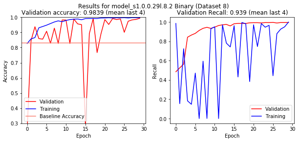
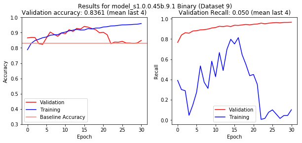
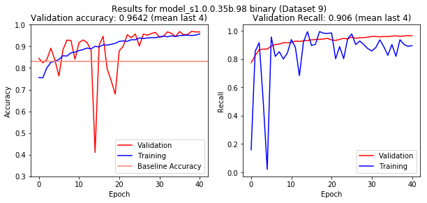

# Dense Prediction of Mammography
Eric Scuccimarra (skooch@gmail.com)

## Introduction
Breast cancer is the second most common cancer in women worldwide. About 1 in 8 U.S. women (about 12.4%) will develop invasive breast cancer over the course of her lifetime. The five year survival rates for stage 0 or stage 1 breast cancers are close to 100%, but the rates go down dramatically for later stages: 93% for stage II, 72% for stage III and 22% for stage IV. Human recall for identifying lesions is estimated to be between 0.75 and 0.92 [1], which means that as many as 25% of abnormalities may initially go undetected. 

The DDSM [6] is a well-known dataset of normal and abnormal scans, and one of the few publicly available datasets of mammography imaging. The CBIS-DDSM [8] is a curated subset of the DDSM dataset. Unfortunately, both datasets are relatively small. In this work we used the entirety of each scan as our training data and the masks provided with the CBIS-DDSM dataset as the labels in order to train a network to do dense prediction for the images.

Our previous work [23] in this area was performing binary classification of scans as normal or abnormal. While our models achieved very good scores on our validation dataset, they did not perform well on scans from other datasets. Investigation into these discrepancies showed that the model was relying heavily on features not related to the presence or absence of abnormalities, such as maximum pixel intensity and image contrast. 

In order to counter this we decided to train the models to do dense prediction, which had the additional benefit of being more useful to radiologists than simple classification.

## Related Work
There exists a great deal of research into applying deep learning to medical diagnosis, but the lack of available training data is a limiting factor.  [1, 4] use ConvNets to classify pre-detected breast masses by pathology and type, but do not attempt to detect masses from scans. [2,3] detect abnormalities using combinations of region-based CNNs and random forests. 

This work is a continuation of our previous work on classification of scans [23].

## Datasets
The DDSM [6] is a database of 2,620 scanned film mammography studies. It contains normal, benign, and malignant cases with verified pathology information. The DDSM is saved as Lossless JPEGs, an archaic format which has not been maintained for several decades. 

The CBIS-DDSM [8] collection includes a subset of the DDSM data selected and curated by a trained mammographer. The CBIS-DDSM images have been pre-processed and saved as DiCom images, and thus are better quality than the DDSM images. 

The DDSM dataset contains images from different scanners which have subtle differences in contrast and brightness. The CBIS-DDSM images have been pre-processed to eliminate these differences. In previous work the models had used these differences to make predictions, so in order to eliminate this possibility we only used CBIS-DDSM images for this work.

## Data Preprocessing

Rather than doing a substantial amount of preprocessing to our data we created one set of RGB images, which had the radiological scan as channel one, the mask as channel two, and black pixels as channel three.    As the same images sometimes contained multiple abnormalities of different types (calcifications and masses) which were represented with separate masks, we combined all masks for each scan into one.

This method provided several advantages:

- By using the full images and randomly cropping them during training we effectively created a training dataset of nearly infinite size.
- Since the mask was included in the image we could simply crop the image and then separate the channels, eliminating the need to crop the masks and the images in the same manner.
- This allowed us to create a model without a fixed input size.

The disadvantage of this method was that each image was approximately 2-3% ROI and 97-98% normal. This resulted in a highly unbalanced dataset where it was not unusual for a batch to contain a very small number of positive pixels. To counter this we created a separate set of images where we cropped the scan to 1280x1280 which each image containing a full ROI. 

The two sets of images were combined into a single training dataset where approximately 6% of the pixels were labeled as positive.

At training time we performed a random crop on each image, followed by random flips and rotations.

## ConvNet Architecture
Our first model was based on [24] and used the architecture from our classification models with the fully-connected layers replaced with transpose convolutions to upsize the image back to the input size. This allowed us to use transfer learning by initializing the weights from our classification models. These models performed decently, but were very slow to train and the resulting weights were upwards of 700MB. 

In addition, we found that using skip connections from the down-sampling to the up-sampling section resulted in predictions which resembled the input far more than they should have. To examine this we extracted each convolutional layer in our model and examined how it was transforming the input. This showed that the final down-sampling layers contained fairly good predictions, which were then distorted in the up-sampling section, reducing the quality of the predictions.

This discovery prompted us to scrap our architecture and start over from scratch in order to create a model which was specifically designed for dense prediction. In order to maintain as much resolution as possible we removed the last two max pools, adding dilation [25] to the following convolution layers. We then removed most of the transpose convolutions, replacing them with resizes only keeping two transpose convolutions as the last two layers before the logits. This had the added benefit of reducing the checkboard artifacts [26].

Our final model was 28 layers. All of our convolutional layers had 3x3 kernels. The downsampling section consisted of blocks of 3 or 4 convolutional layers followed by max pools, or in one case a convolutional layer with a stride of 2. The final max pool was removed and the final 4 convolutional layers were dilated by 2 to provide greater context. The last layer in the down-sampling section was a 1x1 convolution with 256 filters.

The output of the 1x1 convolution was then resized by a factor of 4, fed into a 3x3 convolution, resized again by a factor of 2 and then fed through another 3x3 convolution. This was then upsampled with a 4x4 tranpose convolution with a stride of 2. This was followed by a 4x4 transpose convolution with a stride of 1 to reduce checkerboard artifacts [26] which was followed by a 3x3 convolution and the logits which were 1x1 convolutions. 

Note that the output of the logits was 320x320x1, which was then resized to 640x640x1 before having a sigmoid applied. We found that sizing the output to 640x640 before the logits layer required a significantly higher amount of RAM and computation without providing commensurate improvements in the predictions.

To compensate for the unbalanced dataset we used a weighted sigmoid cross-entropy loss function with positive examples weighted from 14-16 and negative examples weighted at 1. 

<i>Figure 1: Architecture of model 3.9.4.01</i>

### Training

#### Online Data Augmentation

As our training images were full-sized scans which were far too large to use as training examples we had an online pre-processing pipeline which included data augmentation. Each image was read in from disk and sized down to 0.66 of its original size. The image was then randomly cropped and the label and example image separated from the channels of the image. Both the label and the example were then randomly flipped and rotated.

As the size of the examples were significantly smaller than the full-sized images the random crop alone resulted in an near infinite number of training examples. 

#### Context

From previous work we knew that context was important in the detection of abnormalities which led to the creation of our initial datasets in which each image contained a complete ROI with padding. Our models trained on these images were successful at detecting ROIs which were completely contained in the image, but not ROIs which ran off the edges of the image. With a mean size of 450 pixels and a standard deviation of 396, the size of the ROIs ranged from 30 pixels squared to over 1,000 pixels squared. 

Training on small images required less computational power which resulted in substantially faster training, however using smaller images resulted in a higher percentage of the images not providing adequate context for the ROI which resulted in errors predicting larger abnormalities. 

In order to leverage the advantages of training on smaller images we began training on images sized 320x320. After training for about 20 epochs on these images the size was increased to 480x480. The size was then increased to 640x640 and eventually incrementally to 840x840. This method effectively allowed us to fine-tune the model on larger and larger images.

#### Metrics

During training the loss function was a weighted sigmoid cross-entropy loss. A variety of other metrics were monitored during training including intersection over union (IOU) and accuracy, recall, precision and f1 score on both the pixel and image levels. 

## Results

### Predictions

Figure 2 shows an image from our test dataset where the model makes a very accurate prediction. 

<i>Figure 2: Test image with true positive</i>

Figure 3 shows an image with a false positive. In this case the model has identified an area which differs from the surrounding tissue, which is correct behavior.

<i>Figure 3: Test image with false positive</i>

Figure 4 shows another false positive, however this image does not seem to contain anything which appears abnormal. 

<i>Figure 4: Test image with false positive</i>

Figure 5 shows an image with a false negative. 

<i>Figure 5: Test image with false negative</i>

### Performance

| Model              | Dataset | Epochs | Accuracy | Recall |
| ------------------ | ------- | ------ | -------- | ------ |
| 1.0.0.35b.98       | 9       | 40     | .9571    | .9012  |
| 1.0.0.46b          | 9       | 30     | .8370    | .0392  |
| 1.0.0.29n          | 8       | 30     | .9930    | 1.0    |
| 1.0.0.46b          | 6       | 20     | .1810    | 1.0    |
| VGG-16.03.06b.9    | 9       | 30     | .8138    | .9884  |
| inception_v4.05b.9 | 9       | 20     | .1828    | 1.0    |
             
<i>Table 1: Binary Performance on Test Set</i>
 

Table 2 shows the accuracy and recall of the test dataset for selected training runs for multi-class classification. We see the trend of models tending to predict everything as either negative or positive.

| Model           | Dataset | Epochs | Accuracy | Recall | Initialization |
| --------------- | ------- | ------ | -------- | ------ | -------------- |
| 1.0.0.29n       | 6       | 40     | .9142    | .9353  | Scratch        |
| 1.0.0.46l.8     | 8       | 20     | .1139    | 1.0    | Scratch        |
| 1.0.0.46l.6     | 6       | 20     | .8187    | 0      | Scratch        |
| VGG-16.03.04l.6 | 6       | 20     | .8333    | .0288  | Scratch        |
                
<i>Table 2: Multi-class Performance on Test Set</i>
 

Figure 5 shows the training metrics for model 1.0.0.29 trained on dataset 8 for binary classification. This model was trained with a cross entropy weight of 2 which may have contributed to the volatility of the validation results.

 
         <i>Figure 5 - Binary Accuracy and Recall for Model 1.0.0.29 on Dataset 8</i>

Figure 6 shows the training metrics for model 1.0.0.45 trained on dataset 9 for binary classification. We see that this model was learning to predict positive examples through epoch 15, at which point the accuracy drops to the baseline and the recall approaches 0. We believe this is due to the cross entropy weight of 2 used for this model, which encourages the model to ignore positive examples and focus on negative ones.

 
           <i>Figure 6 - Binary Accuracy and Recall for Model 1.0.0.45 on Dataset 9</i>

Figure 7 shows the training metrics for model 1.0.0.35 trained on dataset 9 for binary classification. This model was trained with a cross entropy weight of 6, which compensates for the unbalanced nature of the dataset and encourages the model to focus on positive examples.

 
       <i>Figure 7 - Binary Accuracy and Recall for Model 1.0.0.35 b.98 on Dataset 9</i> 

While model 1.0.0.29 achieved the best results, we were unable to duplicate these results in future training runs and thus conclude that the high recall and accuracy were flukes that were not due to inherent advantages of the model.

Table 3 shows the accuracy and recall of selected models on the MIAS dataset. If we recall that the MIAS dataset was completely separate from, and unrelated to, the DDSM datasets, these results should indicate how well the model will perform on completely unrelated images. 

These results indicate that model 1.0.0.35b.98 was able to achieve relatively high accuracy and recall, while the others traded off precision and recall. For this reason we feel that this model is the most promising one to pursue.

| Model          | Training Dataset | MIAS Accuracy | MIAS Recall |
| -------------- | ---------------- | ------------- | ----------- |
| 1.0.0.35b.98   | 9                | .8883         | .8081       |
| vgg_16.3.06b.9 | 9                | .4357         | .9884       |
| 1.0.0.28.2b.9  | 9                | .9165         | .5342       |
| 1.0.0.46b.8.4  | 8                | .2746         | .9811       |

                
<i>Table 3: Performance on MIAS Dataset</i>
 

### Effect of Decision Threshold

A binary softmax classifier has a default threshold of 0.50. We used pr curves during training to evaluate the effects of adjusting the threshold. We found that we could easily trade off precision and recall by adjusting the threshold, allowing us to achieve precision or recall close to 1.0. We can also see the effects of using different thresholds on recall in figure 8.

Figure 9 is the curve for model 1.0.0.35b.98 after 40 epochs of training. The points on the lines indicate the threshold of 0.50. Precision is on the y-axis and recall on the x-axis.

                                                     <i>Figure 9 - PR Curve for model 1.0.0.35b.98</i> 

## Conclusion
While we were able to achieve better than expected results on datasets 6 and 8, the artificial nature of these datasets caused the models to not generalize to the MIAS data. Models trained on dataset 9, which was constructed specifically to avoid these problems, did not achieve accuracy or recall as high as models trained on other datasets, but generalized to the MIAS data better.

The weight of the cross entropy turned out to be a critical factor in training models which did not overfit the training data, and whose performance could be replicated. We could have saved a great deal of time if we tested different weights earlier in the process.

While we were able to achieve recall significantly above human performance on the DDSM data, the recall on the MIAS data was significantly lower. However, as a proof of concept, we feel that we have demonstrated that ConvNets can successfully be trained to predict whether mammograms are normal or abnormal.

The life and death nature of diagnosing cancer creates many obstacles to putting a system like this into practice. We feel that using a system to output the probabilities rather than the predictions would allow such a system to provide additional information to radiologists rather than replacing them. In addition the ability to adjust the decision threshold would allow radiologists to focus on more ambiguous scans while devoting less time to scans which have very low probabilities.

Future work would include creating a system which would take an entire, unaltered scan as input and analyse it for abnormalities. This could be done with a fully convolutional network which can accept an image of any size. Other algorithms such as a sliding window, YOLO, or attention models could be used to apply our techniques to entire scans. Unfortunately, the lack of available training data seems to be the bottleneck for pursuing this in the future.

## Supplementary Files

### GitHub Repositories
Two personal GitHub repositories were used for this work:

1. https://github.com/escuccim/mias-mammography - contained the Jupyter notebooks and code run locally.
2. https://github.com/escuccim/mammography-models - was used to sync code between my laptop and the Google Cloud instances where the models were trained 

Any documents which are not in this repository should be located in one of those.

### Notebooks
- Wisconsin (UCI) EDA.ipynb - exploratory data analysis of the UCI data
- SVM.ipynb, kNN.ipynb, Decision Trees.ipynb, Multilayer neural networks.ipynb - application of standard machine learning techniques to the UCI data
- UCI Results.ipynb - results of above evaluations
- MIAS Exploratory Data Analysis.ipynb - exploratory data analysis of the MIAS data
- crop_cbis_images_x.ipynb - various methods used to extract ROIs from the CBIS-DDSM dataset for dataset x
- crop_normal_images_x.ipynb - corresponding code to create images from normal DDSM images for dataset x
- crop_mias_images_x.ipynb - corresponding code the create images from the MIAS dataset for dataset x
- review_images_x.ipynb - to review the images created in the above scripts and identify any problems for dataset x
- write_to_tfrecords_x.ipynb - create tfrecords files for dataset x
- convnet_1.0.0.35.ipynb - code used to train model 1.0.0.35 in a notebook, with results and evaluation on test data
- convnet_training_metrics.ipynb - training and validation metrics for selected training runs
- ddsm_results.ipynb - accuracy and recall metrics for selected training runs

### Python Scripts
- mammo_utils.py - functions used in pre-processing data
- training_utils.py - functions used for creating and training models
- inception_utils.py - functions used to create and train our Inception clone
- candidate_x.x.x.x - various candidate models trained
- vgg_16.x.py - code used to create and train our VGG-lite model
- inception_v4.x.py - code used to create and train our Inception-lite model

### Markdown Files
- ReadMe.md - what you are reading right now
- overview_of_image_processing.md - an overview of the steps taken to create and pre-process the image data

### Others
- data/results - metrics generated during training saved as .npy files
- the tfrecords used to train the models are available from download from Amazon S3. The URLs are in training_utils.py.
- Decompressing-For-LJPEG-image - code used to convert the DDSM images from LJPEG to usable images
- model_notes.xlsx - notes kept during training of models, only includes results relevant to this overview

### Training Logs
The TensorBoard training logs are also provided for selected models in the /logs/ directory. The logs include scalar metrics taken every 50 steps, image summaries of the kernels taken every epoch, and pr curves used to evaluate the effect of the decision threshold.

### Models
The following pre-trained models are available for download. Each zip file contains the checkpoint for the model:

- model_s1.0.0.29l.8.2 - trained on dataset 8 for binary classification - https://s3.eu-central-1.amazonaws.com/aws.skoo.ch/files/model_s1.0.0.29l.8.2.zip
- model_s1.0.0.35b.96 - trained on dataset 9 for binary classification - https://s3.eu-central-1.amazonaws.com/aws.skoo.ch/files/model_s1.0.0.35b.96.bu30.zip
- model_s1.0.0.35b.98 - trained on dataset 9 for binary classification - https://s3.eu-central-1.amazonaws.com/aws.skoo.ch/files/model_s1.0.0.35b.98.zip

## References
[1]	D. Levy, A. Jain, Breast Mass Classification from Mammograms using Deep Convolutional Neural Networks, arXiv:1612.00542v1, 2016

[2]	N. Dhungel, G. Carneiro, and A. P. Bradley. Automated mass detection in mammograms using cascaded deep learning and random forests. In Digital Image Computing: Techniques and Applications (DICTA), 2015 International Conference on, pages 1–8. IEEE, 2015.

[3]	N.Dhungel, G.Carneiro, and A.P.Bradley. Deep learning and structured prediction for the segmentation of mass in mammograms. In International Conference on Medical Image Computing and Computer-Assisted Intervention, pages 605–612. Springer International Publishing, 2015.

[4]	J.Arevalo, F.A.González, R.Ramos-Pollán,J.L.Oliveira,andM.A.G.Lopez. Representation learning for mammography mass lesion classification with convolutional neural networks. Computer methods and programs in biomedicine, 127:248–257, 2016.

[5]	Dua, D. and Karra Taniskidou, E. (2017). UCI Machine Learning Repository [http://archive.ics.uci.edu/ml]. Irvine, CA: University of California, School of Information and Computer Science.

[6]	The Digital Database for Screening Mammography, Michael Heath, Kevin Bowyer, Daniel Kopans, Richard Moore and W. Philip Kegelmeyer, in Proceedings of the Fifth International Workshop on Digital Mammography, M.J. Yaffe, ed., 212-218, Medical Physics Publishing, 2001. ISBN 1-930524-00-5.

[7]	Current status of the Digital Database for Screening Mammography, Michael Heath, Kevin Bowyer, Daniel Kopans, W. Philip Kegelmeyer, Richard Moore, Kyong Chang, and S. Munish Kumaran, in Digital Mammography, 457-460, Kluwer Academic Publishers, 1998; Proceedings of the Fourth International Workshop on Digital Mammography.

[8]	Rebecca Sawyer Lee, Francisco Gimenez, Assaf Hoogi , Daniel Rubin  (2016). Curated Breast Imaging Subset of DDSM. The Cancer Imaging Archive.

[9]	Clark K, Vendt B, Smith K, Freymann J, Kirby J, Koppel P, Moore S, Phillips S, Maffitt D, Pringle M, Tarbox L, Prior F. The Cancer Imaging Archive (TCIA): Maintaining and Operating a Public Information Repository, Journal of Digital Imaging, Volume 26, Number 6, December, 2013, pp 1045-1057.

[10]	O. L. Mangasarian and W. H. Wolberg: "Cancer diagnosis via linear programming", SIAM News, Volume 23, Number 5, September 1990, pp 1 & 18.

[11]	William H. Wolberg and O.L. Mangasarian: "Multisurface method of pattern separation for medical diagnosis applied to breast cytology", Proceedings of the National Academy of Sciences, U.S.A., Volume 87, December 1990, pp 9193-9196.

[12]	O. L. Mangasarian, R. Setiono, and W.H. Wolberg: "Pattern recognition via linear programming: Theory and application to medical diagnosis", in: "Large-scale numerical optimization", Thomas F. Coleman and YuyingLi, editors, SIAM Publications, Philadelphia 1990, pp 22-30.

[13]	K. P. Bennett & O. L. Mangasarian: "Robust linear programming discrimination of two linearly inseparable sets", Optimization Methods and Software 1, 1992, 23-34 (Gordon & Breach Science Publishers).

[14]	K. Simonyan, A. Zisserman, Very Deep Convolutional Networks for Large-Scale Image Recognition, arXiv:1409.1556, 2014

[15]	S. Ioffe and C. Szegedy. Batch normalization: Accelerating deep network training by reducing internal covariate shift. In Proceedings of The 32nd International Conference on Machine Learning, pages 448–456, 2015

[16]	C. Szegedy, W. Liu, Y. Jia, P. Sermanet, S. Reed, D. Anguelov, D. Erhan, V. Vanhoucke, and A. Rabinovich. Going deeper with convolutions. In Proceedings of the IEEE Conference on Computer Vision and Pattern Recognition, pages 1–9, 2015.

[17]	C. Szegedy, V. Vanhoucke, S. Ioffe, J. Shlens, and Z. Wojna. Rethinking the inception architecture for computer vision. arXiv preprint arXiv:1512.00567, 2015.

[18]	C. Szegedy, S. Ioffe, V. Vanhoucke, Inception-v4, Inception-ResNet and the Impact of Residual Connections on Learning, arXiv:1602.07261v2, 2016

[19]	K. He, X. Zhang, S. Ren, J. Sun, Deep Residual Learning for Image Recognition, arXiv:1512.03385, 2015

[20]  J. Redmon, S. Divvala, R. Girshick, A. Farhadi, You Only Look One: Unified, Real-Time Object Detection, arXiv:1506.02640, 2015

[21] R. Girshick, J. Donahue, T. Darrell, J. Malik, Rich feature hierarchies for accurate object detection and semantic segmentation, arXiv:1311.2524, 2013

[22] S. Arkhangelskiy, Data Augmentation on GPU in TensorFlow, https://becominghuman.ai/data-augmentation-on-gpu-in-tensorflow-13d14ecf2b19 

[23] E. Scuccimarra, ConvNets for Detection of Abnormalities in Mammograms, 2018, https://medium.com/@ericscuccimarra/convnets-for-classifying-ddsm-mammograms-1739e0fe8028

[24] J. Long, E. Shelhammer, T. Darrell, Fully Convolutional Networks for Semantic Segmentation, https://people.eecs.berkeley.edu/~jonlong/long_shelhamer_fcn.pdf

[25] F. Yu, V. Koltun, Multi-Scale Context Aggregation by Dilated Convolutions, arXiv:1511.07122, 2016

[26] A. Odena, V. Dumoulin, Deconvolution and Checkerboard Artifacts, 2016, https://distill.pub/2016/deconv-checkerboard/

## Citation

<pre>
@misc{ scuccimarra2018.2,
    author = "Scuccimarra, Eric",
    title = "Dense Prediction of Mammography",
    year = "2018",
    url = "https://github.com/escuccim/mias-mammography/blob/master/Report2.md",
  }  
</pre>
